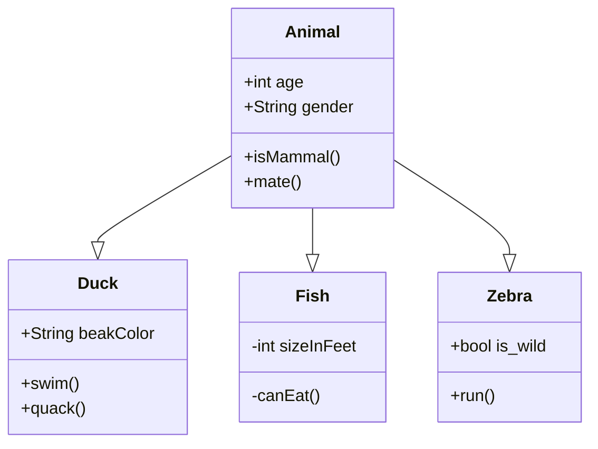

---
{"dg-publish":true,"permalink":"/B/Balk/","title":"Balk","tags":["titleandheadingonedontmatch","multipleentries","stitched"],"created":"2023-11-09T07:00","updated":"2024-02-27T00:47"}
---


# Balk 1)

#### Oláh Imre A Nimrud hagyomány...

...című tanulmányában írja:  
> Baktria volt hajdan a méd-mágus papi rend hona, Balk pedig az Egy Istent tűz jelképében tisztelő mágus-vallás Vatikánja. Az ott íródott Aveszta nevű szent könyv nyelvezete a méd nyelvnek úgynevezett raghai dialektusához tartozott. Két külön elemből: a turáni dualizmusból és az árja mitológia vallási tételeiből állott össze. Ehhez később még sok más indiai elem is vegyült. A baktriai khusok, éppúgy mint később a parthusok, és minden más hun fajú népek, az Istent a tűz jelképében imádták. Ez azt jelenti, hogy hajdan a mágus-hit az Élő Isten földi megjelenését az emberben élő isteni szikra hasonmásának tekintette.  
> A mágus-hit központja még Dárius király idejében is a khusiták Balk nevű városában volt. Mivel pedig a történelem a khusok fiát, magát Nimrudot tartja Balk városa megalapítójának: Nimrud hajdani népének, a balki khusitáknak szellemi hagyatékát elsősorban természetesen maguk a keleti khusok utódai: a szabir-hunok, vagy más néven hajtaliták, ephtaliták, fehér-hunok örökölték (ebdaliták).  
> Ebben a térségben halmozódtak fel az idők folyamán azok a szellemi kincsek, amik a khusok ideje alatt kerültek Kaldeából, tehát sumir földről Baktria földjére. Baktria volt a médek, parthusok népének bölcsője. Fővárosa: Balk pedig, "a városok anyja", fellegvára lett annak a hitszemléletnek, amely [[A/Anahita\|Anahita]], vagyis a mi Nagy-Boldogasszonyunk nevéhez fűződik. Ezzel egykor a világ egyik legősibb kultúráját ringatta féltő kebelén. És amint a gyermek soha se felejti az anyjától tanult beszédet, a Balk városát megalapító Nimrud fejedelem fiai is minden honvisszafoglalás alkalmával azzal az ősi szellemi örökséggel tértek vissza a Kárpát-medencébe, amit valamikor az anyjuktól örököltek valahol Baktriában. Így tehát őseink: Hunor és Magor is örökösei voltak és maradtak mindannak a temérdek szellemi kincsnek, amit Nimrud, Kaldea királya hozott magával valamikor Balk városába, s hagyott ott ránk, mint kései utódaira.  

Ami a nevet illeti, [[B/Balkán\|Balkán]] és [[B/Balog\|Balog]] címnél írottak alapján lehet gondolkodni. 

> [! ]
> ```mermaid
> flowchart
> subgraph Fejlődési szakasz
> id1([WORD]) --> word --> word2 --> id1([WORD])
> end
> ```
- Ezt a fajtát nem tudta elmenteni, csak `flowchart TF`-ben, valamiért.
> [! ]
> ```mermaid
> flowchart
> subgraph Fejlődési szakasz
> word2 -.-> word3
> end
> ```
> 

> [! Magyar gyökök a nosztratikus elmélet szerint]
> ```mermaid
> pie title 
>         "Magyar" : 65
>         "Szanszkrit" : 22
>         "Egyéb" : 13
> ```
- Valahogy CSS-szel kéne változtatni a ronda színeken.



# Balk 2)

[[M/Mestergerenda\|Mestergerenda]]. Igei értelmeit itt mellőzzük.  
A latin `palus` = cölöp (lásd [[P/Pale\|pale]]), amivel kapcsolatos [[P/Pilis\|Pilis]] szavunk is. Palló szavunk padló jelentésű. A falap a deszka.  
[[B/Bálvány\|Bálvány]] szavunk szintén idetartozik. Mindezek tisztán palóc szócsoportbeli szavak.  
Akadály, akadályoz jelentését vizsgálta Varga Csaba is, szerinte ez [[B/BAK\|bak]] szavunk, [[L/L vendéghang\|l vendéghang]]gal.  

Nos, valójában a [[B/Balog\|Balog]] címnél taglalt *balog*fa is megfelelne. Sőt, a [[T/Toll#Toll 2)\|toll]] címnél taglalt támasztó is olyan ötletet vet fel, mely szerint Toldi, Thor is lehetne Orion. [[B/Balog\|Balog]] címnél Orionról is volt szó.  

Götz László Keleten kél a Nap című könyvének 191. oldalán előjön a német `balken` = gerenda, melyet szó szerint "hasított"-nak értelmez GL, miután a [[B/Balog\|Balog]] és [[P/Plow\|plow]] címnél taglalt szavakkal veti őket össze.  
Viszont itt sem utólagosan készült igékből kell kiindulni.  
A kiindulópont [[B/Bál\|Bál]] és a tiszteletére emelt kőoszlop fogalma mely [[P/Pole#Pole 2)\|pole]] = tengely is lehet.  